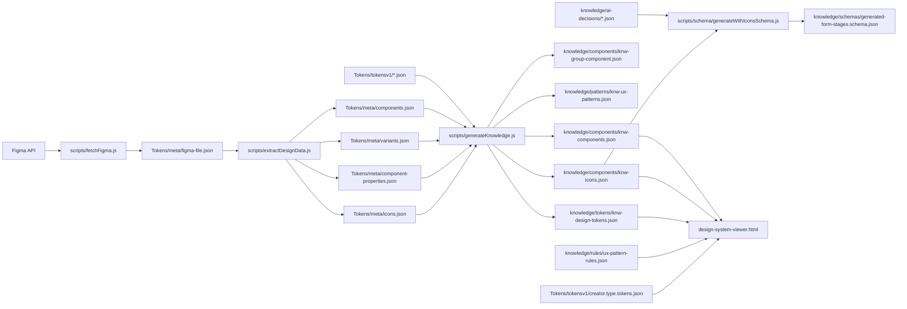

# Pipeline Diagram

This diagram shows how data moves through this project.

## Mermaid diagram



## Plain text version

```text
Figma API
  -> scripts/fetchFigma.js
  -> Tokens/meta/figma-file.json
  -> scripts/extractDesignData.js
  -> Tokens/meta/components.json
  -> Tokens/meta/variants.json
  -> Tokens/meta/component-properties.json
  -> Tokens/meta/icons.json

Tokens/tokensv1/*.json + Tokens/meta/*.json
  -> scripts/generateKnowledge.js
  -> knowledge/components/knw-components.json
  -> knowledge/components/knw-group-component.json
  -> knowledge/patterns/knw-ux-patterns.json
  -> knowledge/components/knw-icons.json
  -> knowledge/tokens/knw-design-tokens.json

knowledge/components/knw-icons.json + knowledge/ai-decisions/*.json
  -> scripts/schema/generateWithIconsSchema.js
  -> knowledge/schemas/generated-form-stages.schema.json

knowledge/{tokens,components,patterns,rules}/*.json + Tokens/tokensv1/creator.type.tokens.json
  -> design-system-viewer.html
  -> dashboard tables in browser
```
